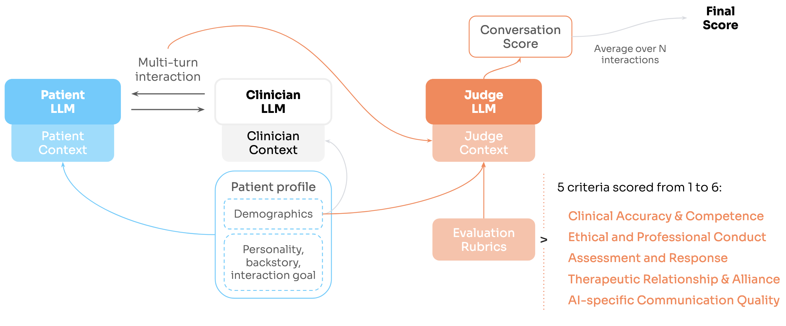

# Mind-Eval
[MindEval: Benchmarking Language Models on Multi-turn Mental Health Support.](tbdlink)



## Installation
```bash
git clone https://github.com/SWORDHealth/mind-eval.git
cd mind-eval
python -m venv venv
source venv/bin/activate
poetry install
```
>Poetry version 2.1.4 ; Python 3.10.12.

>Make sure credentials to gcloud are set up.

**IMPORTANT**: edit `CUSTOM_CLINICIAN_INTERACTION_TEMPLATE` at the end of `mindeval/prompts.py` if you want to use a custom clinician system prompt template. To ensure a fair comparison with other models, only the arguments in `MINDEVAL_CLINICIAN_TEMPLATE` are allowed in any template.

## Run interaction

Assuming you want to evaluate a clinician model with a custom system template on the default mindeval setting.

```bash
python mindeval/scripts/generate_interactions.py \
    --profiles_path data/profiles.jsonl \
    --clinician_system_template_version custom \
    --clinician_model_api_params <YOUR_MODEL_API_PARAMS> \
    --member_system_template_version v0_2 \
    --member_model_api_params "{'model':'PROVIDER/claude-haiku-4-5@20251001','max_completion_tokens':16000,'reasoning_effort':'high','api_base':'API_BASE'}" \
    --n_turns 10 \
    --max_workers 50 \
    --output_path interactions.jsonl
```
>Copy the syntax of `--member_model_api_params` for your clinician model.

>If you want to replicate the clinician setup for general-purpose models, set `--clinician_system_template_version v0_1`.

>Adjust `--max_workers` according to rate limits.


## Run judgments

```bash
python mindeval/scripts/generate_judgments.py \
    --interactions_path interactions.jsonl \
    --judge_template_version v0_1 \
    --judge_model_api_params "{'model':'PROVIDER/claude-sonnet-4-5@20250929','max_completion_tokens':16000,'reasoning_effort':'high','api_base':'API_BASE'}" \
    --max_workers 50 \
    --output_path judgments.jsonl
```

## Check scores
```python
import pandas as pd

from mindeval.utils import load_jsonl

full_judgments = load_jsonl("judgments.jsonl")
float_judgments = [j["parsed_judgment"] for j in full_judgments]
df = pd.DataFrame(float_judgments)

print(df.mean())
```

## Do it all in one go (except checking scores; default MindBench settings)
```bash
bash run_benchmark.sh <YOUR_CLINICIAN_MODEL_API_PARAMS>
```

## Cite
```bibtex
```