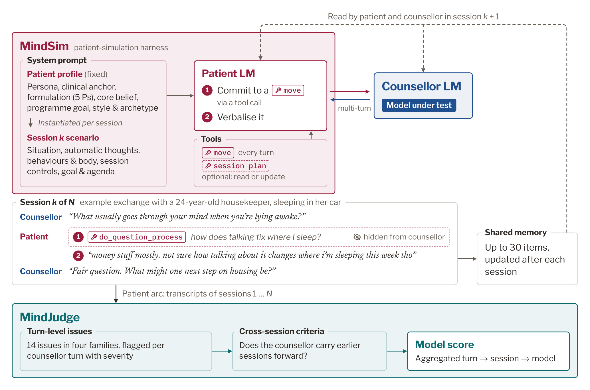

# Mind-Eval
A benchmark for AI mental-health counselors, played against a simulated patient over multiple sessions.

<p align="center">
  
</p>

## What's New
> **📢 September 2026 — MindEval 2.** `master` is now a multi-session benchmark with a new patient
> simulator and a new judge. **Scores are not comparable with MindEval 1**, which stays unchanged on
> the [`legacy`](https://github.com/SWORDHealth/mind-eval/tree/legacy) branch.

- **Multi-session** — 50 synthetic members, 3 sessions each, with a memory log carried between sessions.
- **Patient simulator** — each member picks its next move with a tool call before it writes its turn,
  played from a clinical formulation and a situation that evolves between sessions.
- **MQM judge** — every counselor reply gets an MQM severity from GPT-6.1 Sol (or a judge model of your
  choice), with the prompt that ships in the repo; the benchmark reports the mean and p99 conversation
  severity over every member × session (lower is better).
- **Both judges** — `--judge_version mindeval1` still scores each session with the original
  five-criterion rubric.
- **Pinned arcs** — each member's schedule, time context and per-call seeds are drawn from its id,
  `--seed` and a fixed namespace, never from the config's bytes: every counselor meets the same arcs
  (the ones MindEval 2 was developed on), and an edit such as a comment never re-draws the benchmark.
- **On NeMo UserSim** — every session runs on [NeMo UserSim](https://github.com/NVIDIA-NeMo/UserSim)'s
  engine as its `mindeval` probe, and is also stored as a UserSim trajectory, so UserSim's own tools
  read the run.

## Installation
```bash
git clone https://github.com/SWORDHealth/mind-eval.git
cd mind-eval
uv sync
source .venv/bin/activate
cp .env.example .env
```
>Python 3.12; [uv](https://docs.astral.sh/uv/). `uv sync` also installs NeMo UserSim, from GitHub at the
>commit pinned in `pyproject.toml`.

>Fill in `.env` with the model, endpoint and key of the patient, the counselor and the judge. They
>are read from the environment only, and keys are never written to the outputs.

**IMPORTANT**: the counselor's system prompt is the text file `examples/counselor_system.j2`.
You can change anything in it, or pass your own with `--counselor_system_prompt_path <file>`, but
keep the memory field `{{ memory }}` exactly as it is, once. That is where the counselor receives its
log of the earlier sessions, so every counselor gets the same memory. In session 1 it expands to
"No earlier sessions: this is your first conversation with this member."; later, to "Your log of
previous sessions with this member, oldest first. Lines tagged `[open]` are things the member said
they would do and has not yet reported back on." followed by one line per entry, written after each
session. A prompt without the field, or with it more than once, is refused before the run starts.

## Run interactions
```bash
python mindeval/scripts/generate_interactions.py --output_dir runs/<counselor>
```
>Defaults: the 50 members in `data/profiles.jsonl`, `--sessions 3`, `--max_turns 30` (counselor
>replies; the member may leave sooner), `--max_workers 16`, `--seed 0`. See `--help`.

>The patient is DeepSeek-V4.1-Flash by default, served by vLLM (`hosted_vllm/`) with tool calling that
>honours a named `tool_choice`. When a situation carries an agenda (most do), the member is also
>offered `complete_todo`/`add_todo` with `tool_choice: "auto"` between the move and the words, so a
>vLLM patient needs `--enable-auto-tool-choice` (and a matching `--tool-call-parser`) for that path
>too, not just a named `tool_choice`; the preflight only exercises the named path. Another model can
>play it: set `MINDEVAL_PATIENT_MODEL`, e.g. `vertex_ai/claude-sonnet-4-6`. Add anything else a model
>needs with `--patient_params`. A `vertex_ai/` model needs `uv sync --extra vertex`.

>Provider-specific counselor settings go in `--counselor_params`, e.g. `'{"reasoning_effort": "high"}'`.

>Each counselor gets its own earlier replies back as its API returned them, reasoning included, as
>models trained on preserved thinking expect. OpenAI reasoning models return it only through the
>Responses API: run them as `azure/responses/<deployment>` (or `openai/responses/<model>`) with
>`--counselor_params '{"include": ["reasoning.encrypted_content"], "store": false}'`.

>Rerun the same command to resume: finished members are kept, and unfinished sessions restart.

>Every session runs on NeMo UserSim's engine. `mindeval/probe.py` registers the `mindeval` probe (also
>through the `usersim.probes` entry point, so `usersim smoke` lists it): it runs the whole session itself,
>member and counselor alternating, and every model call goes through UserSim's `acall_llm`. A session's
>UserSim row carries everything it reads except keys, so a host can also run it through UserSim's hosted
>runtime, provided its patient answers the move as JSON content: that runtime takes tool calls only from
>the assistant. The rows are written under `usersim/` (see Outputs), where
>`usersim eval --trajectories runs/<counselor>/usersim --out <dir>` reads them; the MQM judge below reads
>the traces.

>The member can be railed by the Guard from MindSim, mindeval's patient harness: seven pure rules over
>each committed move's disclosure level, which veto a move that gives away more, or less, than this
>member would at this point of the session, and clamp it after `max_retries`. It is off; set
>`enabled: true` in `mindeval/config/guard.yaml` to turn it on. That changes the config fingerprint, so
>a railed run is a different benchmark, and its verdicts are recorded on each turn
>(`meta.guard`, and the `guard_*` flags).

## Run judgments
```bash
python mindeval/scripts/generate_judgments.py --output_dir runs/<counselor>
```
>The judge is GPT-6.1 Sol by default: `.env.example` sets `MINDEVAL_JUDGE_MODEL=openai/gpt-6.1-sol` (it
>needs `OPENAI_API_KEY`; on Azure, use `azure/<deployment>`), and the script's defaults are its settings:
>`--judge_params '{"reasoning_effort": "high"}'`, no temperature, `--judge_max_tokens 32768`. Another
>judge model goes in `MINDEVAL_JUDGE_*`, but its scores aren't comparable with the benchmark's.

>The judge prompt is in `mindeval/judge_prompts.py`. A system message holds the task, severities, rubric
>and answer format, identical on every call so providers can cache it (`MINDEVAL2_JUDGE_SYSTEM_PROMPT`).
>A user message holds only the example: the conversation so far and the reply to judge
>(`MINDEVAL2_JUDGE_USER_PROMPT`). `MINDEVAL_JUDGE_PROMPT` replaces both with one template in a file, sent
>as a single user message; verdicts from any other prompt aren't comparable with the benchmark's.
>Rerun to resume. It can run while `generate_interactions.py` is still going: only finished sessions
>are judged. The first pass preflights: a judge that can't return a usable verdict for any of the
>first three units stops before spending the rest of the budget. A unit that keeps failing never
>blocks the ones after it; it stays pending.

>Provider-specific judge settings go in `--judge_params` (`'{}'` sends none); like
>`--counselor_params`/`--patient_params` it can't set `model`, `api_base` or `api_key`. It's part of
>the judge's identity, like the model, prompt, temperature and max tokens: once a verdict exists, a
>later pass with different params is refused (exit 2). Move `judge/<version>/` aside to judge again
>with other settings.

The original five-criterion rubric takes a judge model the same way. Its `<member_details>` is the counselor's own memory for that session — what it
received in `{{ memory }}`, not the member's private profile — so a counselor that correctly recalls
session 1 isn't scored as though it hallucinated:
```bash
python mindeval/scripts/generate_judgments.py --output_dir runs/<counselor> --judge_version mindeval1
```

## Check scores
```bash
python -c "import json; print(json.load(open('runs/<counselor>/judge/mindeval2/summary.json'))['mqm'])"
```
The score is the **MQM conversation severity**, and lower is better. Each reply is weighted by
severity: No concern 0, Minor 1, Major 5, Critical 10, averaged within each session and then over
every member × session, so one long session can't outweigh several short ones. The averaging also
dilutes a single severe reply in a long session (one Critical among 30 clean replies scores 0.33), so
`mqm.incidents` reports beside it the share of sessions with at least one Critical reply (`critical`)
and with at least one Major or Critical (`major_or_worse`). `summary.json` also has severity and issue
rates.

```bash
python -c "import json; print(json.load(open('runs/<counselor>/judge/mindeval1/summary.json'))['means'])"
```
The v1 rubric scores each session on five criteria plus their mean (`Overall score`), all 1-6 where
higher is better; `summary.json` gives the mean of each over every member × session.

## Do it all in one go
```bash
bash run_benchmark.sh runs/<counselor> [mindeval2|mindeval1]
```
>Runs interactions then judgments for the given judge version (default `mindeval2`), then prints the
>summary. A refused interactions pass (exit 2) stops before judging anything; a partial one (exit 1)
>is still judged, and the script's own exit code reports the worse of the two stages.

## Outputs
```
runs/<counselor>/
  run.json                  what ran: models, endpoints, prompt and profile hashes, settings
  members/<id>/arc/ep00N/   per session: trace.jsonl (every turn), situation.yaml, log.md (the memory after it)
  usersim/run=<id>/locale=en_US/probe_family=mindeval/
                            per session: its NeMo UserSim row (conversation, outcome, call accounting), as
                            `usersim simulate` stores one
  judge/mindeval2/          MQM: judge.json, verdicts.jsonl, summary.json
  judge/mindeval1/          five-criterion rubric: judge.json, verdicts.jsonl, summary.json
```

## Data and license
The 50 members are synthetic. Their persona seeds come from
[nvidia/Nemotron-Personas-USA](https://huggingface.co/datasets/nvidia/Nemotron-Personas-USA) (CC BY
4.0). A language model turned them into clinical formulations, Claude Sonnet 4.6 wrote the session-1
situations, and a handful of words were edited by hand.

The code is licensed under [Apache 2.0](LICENSE). Models and data are licensed under CC BY-NC-SA 4.0,
including the member profiles and the MQM judge prompt (`MINDEVAL2_JUDGE_SYSTEM_PROMPT` and
`MINDEVAL2_JUDGE_USER_PROMPT`). MindEval 1's profiles, human annotations and meta-evaluation data are
unchanged on the [`legacy`](https://github.com/SWORDHealth/mind-eval/tree/legacy) branch.

## Cite
MindEval 2:
```bibtex
@misc{mendonca2026mindeval2,
      title={MindEval2: Benchmarking Language Models on Multi-Session Mental Health Support},
      author={John Mendonça and Daniel Tschernutter and José Pombal and Areti Vassilopoulos and Catarina Botelho and Maya D'Eon and Nuno Guerreiro and Ricardo Rei},
      year={2026},
      note={Preprint},
      url={https://github.com/SWORDHealth/mind-eval},
}
```

MindEval 1:
```bibtex
@misc{pombal2025mindevalbenchmarkinglanguagemodels,
      title={MindEval: Benchmarking Language Models on Multi-turn Mental Health Support}, 
      author={José Pombal and Maya D'Eon and Nuno M. Guerreiro and Pedro Henrique Martins and António Farinhas and Ricardo Rei},
      year={2025},
      eprint={2511.18491},
      archivePrefix={arXiv},
      primaryClass={cs.CL},
      url={https://arxiv.org/abs/2511.18491}, 
}
```
